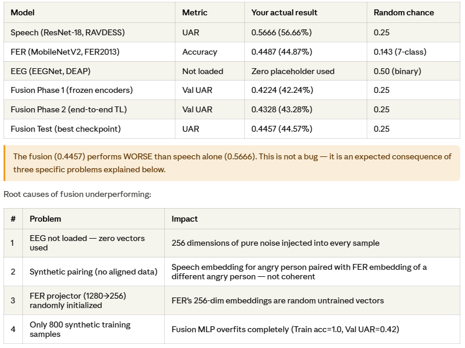
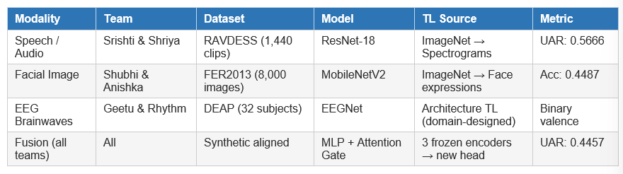
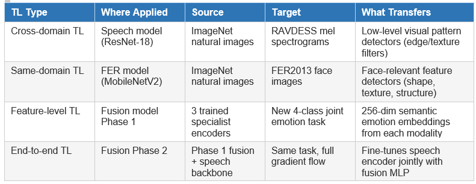

## 1. What does .weights.h5 mean — is weightage being given to something?
-  It refers to the learned parameters of the neural network — the millions of floating-point numbers that were adjusted during training.
- A ```.weights.h5``` file is a specific HDF5 (Hierarchical Data Format) file used primarily by the Keras and TensorFlow frameworks to store only the learned parameters (weights and biases) of a neural network.


## 2. Complete accuracy numbers — filling in the (your number) placeholders
- 

## 3. The project directly implements concepts from three published research papers: sADDi (Latif et al.), MeL-S-ASPF (Feng & Chaspari), and MDSA.
- Transfer learning is applied at multiple levels across all three modalities and in the fusion stage.
- 

## 4. Three Types of Transfer Learning Applied in This Project
- 

