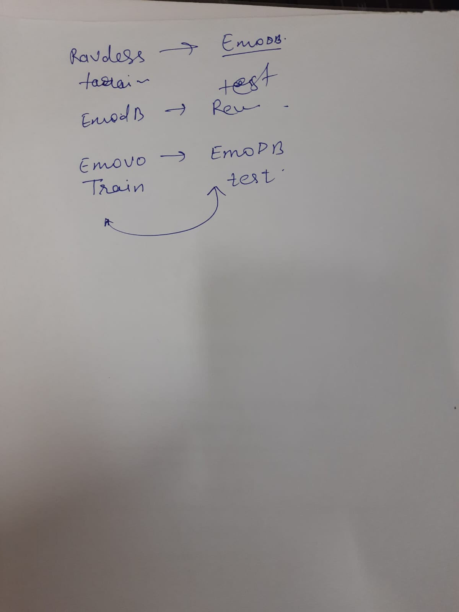

- mam asked to implement cross lingual datasets ka cross corpus TL.

---

1. data augmentation: to increase the dataset by adding variety of features in the existing small dataset for deep learning, to mitigate DATA IMBALANCE.
2. zero shot learning: Zero-Shot Learning (ZSL) is a model's ability to correctly recognize or categorize data from classes it has never seen during its training phase.
3. how are UAR and accuracy different?
- Accuracy is highly misleading when your dataset is imbalanced. In your RAVDESS logs, you have 864 neutral samples but only 192 happy samples.
- UAR: It treats every emotion as equally important. Even if you have 10,000 neutral clips and only 10 angry clips, the model's ability to find those 10 angry clips weighs just as heavily as its ability to find the neutral ones.